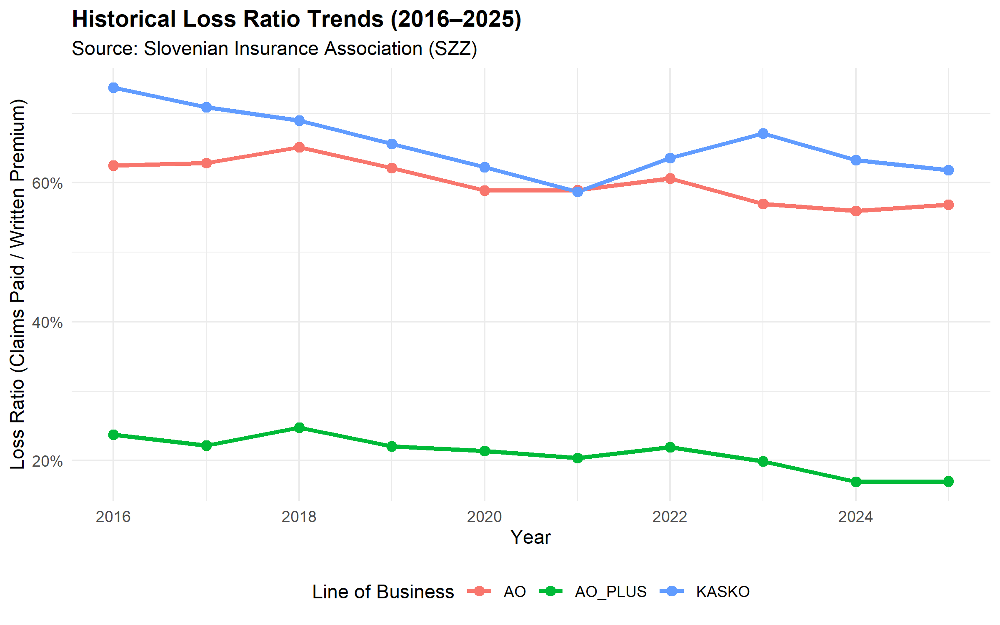

# Solvency II Motor insurance Actuarial & Reserve Model

An actuarial modeling framework for analyzing the Slovenian motor insurance market (MTPL/AO, AO+, KASKO) using historical data from the Slovenian Insurance Association (SZZ) spanning 2016–2025.

The project processes market data in an SQLite database, estimates claim severity inflation via log-linear regression, and runs Monte Carlo simulations (Poisson + Lognormal) to compute Best Estimate Liabilities (**BEL**) and Solvency Capital Requirements (**SCR**) under Solvency II standards.

[LIVE DEMO](https://solvency-ii-motor-insurance-actuarial-reserve-model-2026-p5en7.streamlit.app/)

---

### Historical Loss Ratio Validation (R Output)


---

## Core Features

* **Data Storage (SQLite):** Reads historical premiums, claims paid, and policy counts from SZZ records into a local `szz_market.db` database.
* **Claims Inflation:** Uses log-linear regression to estimate severity growth trends and underlying volatility ($\sigma$) across business lines.
* **Monte Carlo Loss Simulation:** Simulates aggregate claims for 2026 projections:
  * **Claim Frequency:** Poisson distribution ($\lambda$).
  * **Claim Severity:** Lognormal distribution ($\mu, \sigma$) with lognormal convexity adjustment ($\exp(\mu + 0.5\sigma^2)$).
* **Solvency Capital ($SCR_{99.5}$):** Estimates Value at Risk at a 99.5% confidence level over a 1-year horizon.
* **R Data Validation:** Independent R script (`dplyr`, `ggplot2`) to query the database and audit historical loss ratio trends.
* **Streamlit Dashboard:** Interactive web interface for adjusting simulation parameters and visualizing loss distributions.

---

## Repository Structure

```text
.
├── data/                  # Historical CSV data (SZZ records 2016–2025)
├── szz_market.db          # Local SQLite database (generated)
├── database_setup.py      # Database setup and data ingestion script
├── model_engine.py        # Actuarial calculations and Monte Carlo simulation
├── app.py                 # Streamlit dashboard
├── scripts/
│   └── analysis_module.R  # R validation script
├── requirements.txt       # Python dependencies
└── README.md              # Documentation
```

---

## How It Works

* **Database Setup (`database_setup.py`):** Loads raw historical CSV data into SQLite (`szz_market.db`).
* **Actuarial Calculations (`model_engine.py`):**
  * Extracts exposure, claims, and loss ratios from the database.
  * Fits log-linear regression to estimate claim severity inflation.
  * Projects 2026 expected liabilities (BEL) with lognormal convexity adjustments.
  * Runs Monte Carlo loss simulations (2,000+ iterations) across portfolio segments.
* **Interactive Dashboard (`app.py`):** Displays aggregated portfolio projections and tail risk metrics.
* **Independent R Audit (`scripts/analysis_module.R`):** Queries SQLite directly to verify historical loss ratios and generate plots with `ggplot2`.

---

## Key Projections (2026)

* **Best Estimate Liabilities (BEL):** Total projected claims of €637.0M across all three motor lines for 2026.
* **Solvency Capital Requirement ($SCR_{99.5}$):** Capital buffer estimated at €44.8M at a 99.5% Value at Risk level to absorb 1-year tail risk.
* **Portfolio Exposure:** Comprehensive Motor (KASKO) and MTPL (AO) represent the largest market shares, with historical 10-year average loss ratios of 65.6% and 60.1%, respectively.

---

## Key Takeaways & Design Decisions

* **Data Management:** Decouples raw CSV storage from modeling logic using an SQLite database layer.
* **Actuarial Modeling:** Uses compound distributions (Poisson claim counts + Lognormal claim amounts) matching standard non-life reserving practices.
* **Regulatory Standard:** Aligns capital adequacy metrics ($VaR_{99.5}$) with Solvency II standard formula guidelines.
* **Cross-Validation:** Uses R alongside Python to cross-check loss ratio metrics directly against the database.

---

## Limitations & Future Enhancements

* **Reserving Triangles:** Adding run-off triangles to enable traditional reserving methods (Chain Ladder, Bornhuetter-Ferguson).
* **Inter-Line Dependency:** Implementing copulas (e.g., Gaussian or Clayton) to model correlated tail risk between lines rather than assuming independence.
* **Inflation Scenarios:** Expanding sensitivity testing to analyze model performance under dynamic macroeconomic shocks.

## How to Run the Project

1. **Clone the repository:**
   ```bash
   git clone https://github.com/klepecvabicrok/Solvency-II-Motor-insurance-Actuarial-Reserve-Model-2026.git
   cd Solvency-II-Motor-insurance-Actuarial-Reserve-Model-2026
   
2. **Install dependencies:**
   ```bash
   pip install -r requirements.txt
   ```

3. **Initialize the database:**
   ```bash
   python database_setup.py
   ```

4. **Launch the dashboard:**
   ```bash
   streamlit run app.py
   ```

5. **Run the R audit script:**
   ```bash
   Rscript scripts/analysis_module.R
   ```